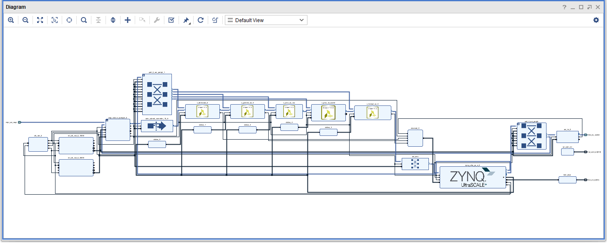

Build Bitstream file
------------------------------------------------------------------------------------

### Block Design



### Requirement

* Xilinx Vivado 2023.1

### Create Project

```
Vivado > Tools > Run Tcl Script... > RasPi-Camera-V2-KV260/fpga/raspi-camera-v2-w8x1-hp0/create_project.tcl
```

### Implementation

```
Vivado > Tools > Run Tcl Script... > RasPi-Camera-V2-KV260/fpga/raspi-camera-v2-w8x1-hp0/implementation.tcl
```

### Convert from Bitstream File to Binary File

```console
vivado% cd RasPi-Camera-V2-KV260/fpga/raspi-camera-v2-w8x1-hp0/
vivado% bootgen -image design_1.bif -arch zynqmp -w -o raspi-camera-v2-kv260-w8x1-hp0.bin
```

### Compress raspi-camera-v2-kv260-w8x1-hp0.bin to raspi-camera-v2-kv260-w8x1-hp0.bin.gz

```console
vivado% cd RasPi-Camera-V2-KV260/fpga/raspi-camera-v2-w8x1-hp0/
vivado% gzip raspi-camera-v2-kv260-w8x1-hp0.bin
```

